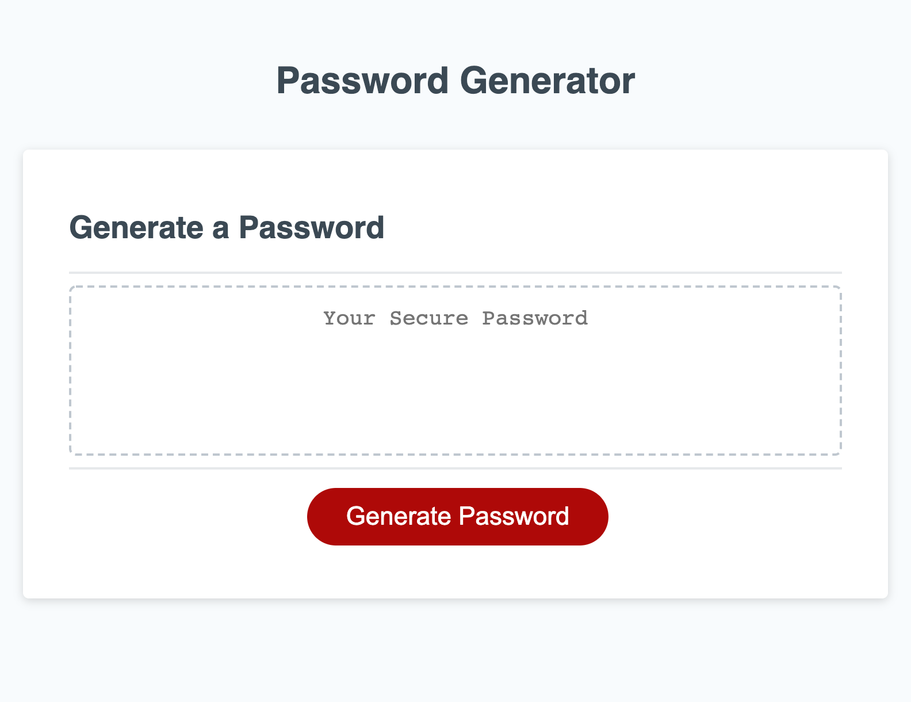

# Password Generator
  
## Description
  
- The motivation behind this project was to create a generator that can make a strong password between 8 and 128 characters.
- I decided to build this project in JavaScript so that when creating a password, there can be greater security.
- It solves a security problem that many people are vunerable to. If there is not a strong password, it will be easy to get into private information.
- I learned how to apply JavaScript in a very applicable way by making this generator. I was able to create complex functions that work.
  
## Screenshot

 
## Link

- https://vivicowan.github.io/password-generator/

